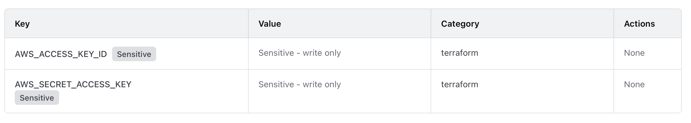

Automated Cluster Creation
-----------------------------

**Terraform** is an Infrastructure-as-Code (IaC) tool used to provision and manage cloud 
infrastructure, such as servers, networks, and storage, across platforms like AWS. 
It defines resources in declarative .tf files, allowing you to create or destroy environments 
consistently and repeatably.

**Ansible** complements Terraform by handling configuration management and automation. 
After Terraform builds the infrastructure (e.g., EC2 instances on AWS). 
Ansible installs software, sets up services, and applies system configurations using 
YAML-based playbooks.

**HashiCorp Cloud Platform (HCP)** provides managed services and state storage for Terraform 
and other HashiCorp tools, ensuring collaboration, version control, and secure remote 
state management.

Terraform uses HCP to plan and provision resources on AWS; Ansible then configures those 
instances and deploys applications- forming an automated, end-to-end workflow for building, 
managing, and scaling cloud or HPC environments.

AWS IAM User
~~~~~~~~~~~~~~~

In AWS, first create an IAM user and then create an access key id and access key for the 
IAM user. Then install the AWS CLI on your local system. Once installed, set up the AWS 
CLI credentials and configuration for your IAM user.

.. code-block:: bash

    aws configure --profile terraform-user

    AWS Access Key ID [None]: A*********************T
    AWS Secret Access Key [None]: 7************************4             
    Default region name [None]: us-east-1
    Default output format [None]: yaml

`terraform-user` is the name of my IAM user.
`A*********************T` is the access key ID I created when setting up a key from my IAM user terraform-user.
`7************************4`  is the secret key of my IAM `user terraform-user`.

To check if the set up worked run the following commands:

.. code-block:: bash

    aws configure list
    aws sts get-caller-identity

HCP Account and Terraform
~~~~~~~~~~~~~~~~~~~~~~~~~~~~

First, create a Hashicorp account (you can use the GitHUB SSO for this). Then, create an 
HCP user token. We will be using this token to log in from the local system later.

Now, create an organization in the HCP account. You will be using this organization in one 
of the Terraform file later. For the time being, let's call the organization `HpcOrg`. Inside 
the organization, `HpcOrg` create a project- let's call it `HpcProj`. Now, within that 
`HpcProj` create a workspace called `HpcWrkspc`.

Then create a variable set called `aws_credentials` with the following values.

* **AWS_ACCESS_KEY_ID** holds the key ID of your AWS IAM user.
* **AWS_SECRET_ACCESS_KEY** holds the secret access key of your IAM user.

This allows us to connect the HCP cloud account with the IAM user account. The advantage of 
the variable set is that it can be reused on multiple projects and workspaces. 
As you maybe using the same IAM user for multiple projects, it is a good idea to have the 
IAM user credentials as a variable set.

In addition to the variable set, create variables specific to this workspace. In this case, 
our workspace-specific variables are

* **ami** : Which give the AMI of the Rocky 9.6 OS we are using.

* **instance_type**: Which give the compute type we are using, in this case `t3.2xlarge`.

The AMI and instance type we use here may not be available for the free tier of the AWS account. 
We also tested Ubuntu and Red Hat AMI, but it was difficult installing some packages in both. 
We also tried the free tier of instance type, but it was running into memory issues when 
building and installing the required packages.

The adavantage of having the AMI and instace type as the variable is that you can chnage 
both without changing your Terraform files. In fact, it is a goof idea to have all the 
AWS specific values in the Terraform file as a variable in the workspace.

Now that the HCP account is set up you can log in to the HCP from the CLI of your local system.

.. code-block:: bash

    terraform login

This will prompt you for the HCP token details and you should enter that. 

Now create SSH key we can use within all the AWS instance

.. code-block:: bash

    ssh-keygen -t rsa -b 4096 -f ~/.ssh/terraform-user -C "terraform-user"

When we run the Terraform files, the public key `terraform-user.pub` will automatically be 
added to all the AWS instances. This will help us log in to the instances if we need to 
troubleshoot any problems.

Now that the AWS IAM user, the HCP cloud user, and the SSH key are set up, clone the repo

.. code-block:: bash

    git clone https://github.com/josephjohnjj/hpc_on_aws.git
    cd pbs-cluster

Now copy the SSH key terraform-user.pub to the directory `keys/` within the directory 
`pbs-cluster`

.. code-block:: bash

    cp ~/.ssh/terraform-user.pub keys/terraform-user.pub

In the directory pbs-cluster, there will be a file named `main.tf`, with the Terraform block.

.. code-block:: bash

    cloud {
    	organization = " "
    	workspaces {
    		name = " "
    	}
    }

In this block, set the following values

.. code-block:: bash

    organization = "HpcOrg"
    name = HpcWrkspc
    
and then run the following Terraform commands

.. code-block:: bash

    terraform init
    terraform apply

After some prompt, where you have to type yes, this will provision your instance in your 
AWS account. You can check this by logging in to your AWS account and checking the EC2 
dashboard. After verifying that the instances are running, you can run the Ansible files 
to set up the various components of the HPC setup.

Ansible
~~~~~~~~~

Now that all the required instances are provisioned in AWS, run the file `generate_host.sh` 
in `pbs-cluster/ansible`.

.. code-block:: bash

    cd ansible
    sh generate_host.sh

This will generate an Ansible inventory `hosts.ini` file, which looks similar to this.

.. code-block:: bash

    [control]
    node1 ansible_host=44.201.254.248 ansible_user=rocky ansible_ssh_private_key_file=/home/joseph/.ssh/terraform-user

    [login]
    node2 ansible_host=3.88.173.215 ansible_user=rocky ansible_ssh_private_key_file=/home/joseph/.ssh/terraform-user

    [compute]
    node3 ansible_host=44.202.113.17 ansible_user=rocky ansible_ssh_private_key_file=/home/joseph/.ssh/terraform-user
    node4 ansible_host=44.202.11.184 ansible_user=rocky ansible_ssh_private_key_file=/home/joseph/.ssh/terraform-user
    node5 ansible_host=18.205.106.239 ansible_user=rocky ansible_ssh_private_key_file=/home/joseph/.ssh/terraform-user

    [storage]
    node6 ansible_host=3.83.203.67 ansible_user=rocky ansible_ssh_private_key_file=/home/joseph/.ssh/terraform-user
    node7 ansible_host=3.84.253.146 ansible_user=rocky ansible_ssh_private_key_file=/home/joseph/.ssh/terraform-user

    [all:children]
    control
    login
    compute
    storage

An Ansible inventory file lists all the hosts that Ansible manages and organizes them into 
groups. Each host entry can include connection details like IP address, SSH user, and 
private key. Inventory files allow you to target specific groups or the entire infrastructure 
when running playbooks or commands, making automation across multiple systems structured and 
efficient.

This inventory file defines a cluster of nodes grouped by role: control, login, compute, and 
storage. Each node entry specifies its IP address, SSH user (rocky), and the private key 
(terraform-user) for authentication. The [all:children] section creates a parent group 
that includes all subgroups, allowing Ansible to target the entire cluster or individual 
groups for playbooks and commands. Essentially, it provides Ansible with a structured map 
of the cluster and connection details for automated management.

I have organised the Ansible play into different directories, and you can install the 
different components by running the following commands from `pbs-cluster/ansible`:

.. code-block:: bash

    ansible-playbook -i host.ini 0_packages/1_update_packages.yml
    ansible-playbook -i host.ini 1_setup_ssh/0_master.yml
    ansible-playbook -i host.ini 2_setup_beegfs/0_master.yml
    ansible-playbook -i host.ini 3_setup_pbs/0_master.yml
    ansible-playbook -i host.ini 4_ldap_server/0_master.yml
    ansible-playbook -i host.ini 5_prometheus_grafana/0_master.yml

or install everything in a single go using

.. code-block:: bash

    ansible-playbook -i host.ini deploy.yml

Now you can login to the Login node as a the `testuser1`, with password `testuser` and 
try submitting a simple PBS job to check if everything is working as expected.

.. code-block:: bash

    ssh testuser1@<login nodde ip>

The following section will explain what is happening with the individual components in the HPC
cluster