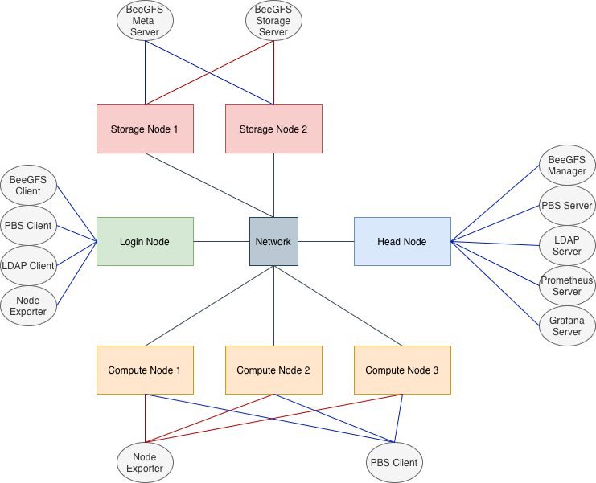

Cluster Design
------------------

The main design elements of the cluster will be as follows

The cluster will have seven virtual machines (VMs)

1. One head/control node
2. One login node
3. Three compute nodes
4. Two storage nodes

All the VMs will have the 

1. OS Rocky Linux 9.6 (Blue Onyx)

    * AMI: `ami-0f2425d4cce4e97dd`

    * Instance Type: `t3.2xlarge`

2. **BeeGFS** is used as the shared filesystem
3. **OpenPBS** is used as the HPC job scheduler 
4. **OpenLDAP** is used for user management
5. **Prometheus** and **Grafana** is used for cluster monitoring

We use the following nomenclature throughout

* Each machine/VM in the cluster will be called `node` 

* The laptop or the desktop we use will be called `local system`

