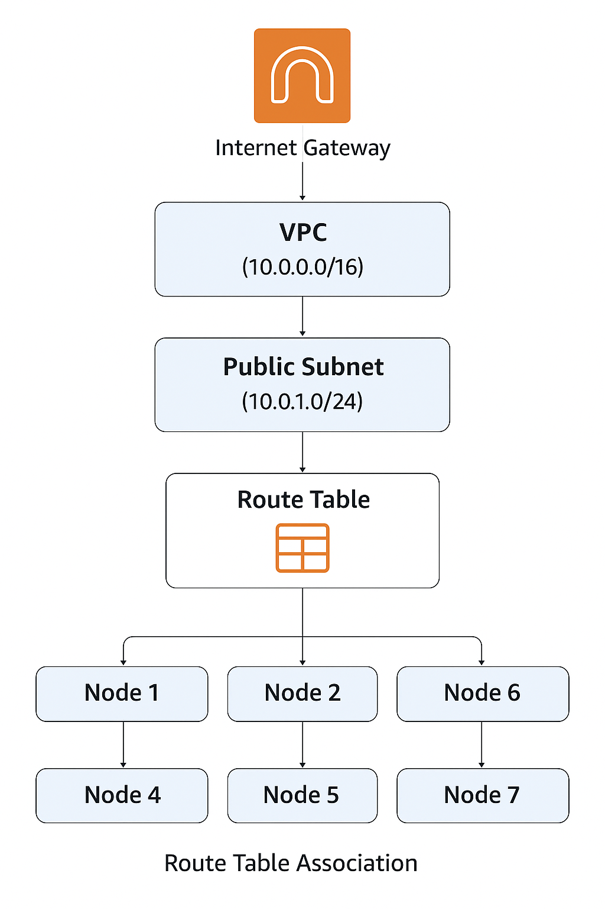

Virtual Machine Setup
-------------------------

This document section the different aspects of the VMs deployed in the cluster and describes 
how each component fits into the design.

    * The cluster will have seven virtual machines (VM)

    * One head / control node

        - One login node

        - Three compute nodes

        - Two storage nodes

* All the VMs will have the OS Rocky Linux 9.6 (Blue Onyx)

* AMI: ami-0f2425d4cce4e97dd

    - Instance Type: t3.2xlarge

* When the VMs are created, an SSH key, terraform-user, is already added.

* This makes it easy to log in to the VM from the local system using `~/.ssh/terraform-user`.

* Each node in the system has three hard disks.

    - /dev/nvme0n1, /dev/nvme1n1 and /dev/nvme3n1

    - /dev/nvme0n1 contains the root filesystem

Networking Architecture
~~~~~~~~~~~~~~~~~~~~~~~~~~~

The network architecture in this AWS cluster has five components.

1. Virtual Private Cloud (VPC)

2. Internet Gateway (IGW)

3. Public Subnet

4. Route Table

5. Route Table Association 

Virtual Private Cloud (VPC)
~~~~~~~~~~~~~~~~~~~~~~~~~~~~

A VPC is a private network in AWS where you can launch resources like EC2 instances. It lets 
you control IP ranges, subnets, route tables, and gateways, effectively creating an isolated 
cloud network for your applications. In this setup, we have a single VPC. The two main aspects 
of the VPC are

* Classless Inter-Domain Routing (CIDR ): This defines the IP address range for the VPC. 
The 10.0.0.0/16 means the network can have up to ~65,536 addresses, which are private and 
used only inside your VPC.

* DNS support and DNS hostnames enabled for EC2 instances: This allows AWS to assign 
internal domain names to instances (like ip-10-0-1-5.ec2.internal) and lets them resolve 
each other by hostname, making internal communication easier.

Public Subnet
~~~~~~~~~~~~~~~~~~~~~

A Public Subnet is a subdivision of a VPC that allows instances to be directly reachable 
from the internet. It is where you put resources that need to talk to the internet while keeping 
the rest of your network private. 

* Has its own CIDR block, e.g., 10.0.1.0/24, which provides ~250 usable IP addresses within the VPC. 

* Public IP assignment enabled (map_public_ip_on_launch = true), so instances automatically get a public IP when launched.

Internet Gateway 
~~~~~~~~~~~~~~~~~~~~~

An Internet Gateway (IGW) is a virtual gateway in AWS that connects a VPC to the internet. 
This is where traffic to clusters enters and where the traffic from the cluster exits.
It allows EC2 instances in public subnets to:

* Send outbound traffic to the internet.

* Receive inbound traffic from the internet.

The IGW must always be attached to a specific VPC to function and  it is always associated with 
a routing table.

Public Route Table
~~~~~~~~~~~~~~~~~~~~~~~~~~~

A route table is like a map that tells network traffic where to go. The public route table is 
specifically for subnets that need internet access. It has two main components.

* cidr_block - This represents all IPv4 addresses on the Internet.
        - In other words, any destination not inside your VPC's private network.
        - It's often called the “default route”.

* gateway_id - This tells AWS to send that traffic to the Internet Gateway (IGW).
    - The IGW acts as the bridge between your VPC and the internet.

In this case, all outbound traffic is redirected to the internet gateway we have defined.

Route Table Association
~~~~~~~~~~~~~~~~~~~~~~~~~~~~

A route table association connects a subnet to a specific route table - it tells the subnet 
which route to use for sending and receiving network traffic.

In summary, a VPC (Virtual Private Cloud) is your own private network inside AWS. Within it, 
you create subnets—smaller sections of the network—to organize and control access. A public 
subnet is one that can connect to the internet, and it does this through an Internet Gateway 
(IGW), which acts like a door between your VPC and the internet. To make traffic flow correctly,
a route table provides the "map" that tells data where to go—for example, sending all outside 
traffic (0.0.0.0/0) through the IGW. Finally, a route table association links that route table 
to a subnet, so instances in that subnet follow those routes. Together, these components let you 
control which resources are private and which can reach the internet safely.

Security Groups (SG)
~~~~~~~~~~~~~~~~~~~~~~~~~

Security Groups in AWS act as virtual firewalls for your EC2 instances, controlling both 
inbound and outbound traffic. They are stateful, meaning if you allow incoming traffic on a 
port, the response is automatically allowed. Each security group is associated with a single 
VPC and can be applied to one or more instances.

A VPC can have multiple security groups associated with it. In SG, rules can allow traffic 
from specific IPs, CIDR ranges, or other security groups, making them flexible for controlling 
access both internally and externally. As we only have one VPC, all the security groups are 
associated with it. In this setup, we have three security groups:

1. SSH Access Security Group

2. Internal Node Communication Security Group

3. Monitoring Security Group

SSH Access Security Group 
^^^^^^^^^^^^^^^^^^^^^^^^

* Allows inbound SSH (TCP port 22) from anywhere (IPv4 0.0.0.0/0 and IPv6 ::/0).

* Outbound traffic: all traffic allowed to any destination.

Internal Node Communication Security Group 
^^^^^^^^^^^^^^^^^^^^^^^^

* Allows all inbound traffic from other instances in the same Security Group .

* Outbound traffic: all traffic allowed.

Monitoring Security Group 
^^^^^^^^^^^^^^^^^^^^^^^^

* Allows inbound:

    - Prometheus (TCP port 9090) from anywhere.

    - Grafana (TCP port 3000) from anywhere.

* Outbound traffic: all traffic allowed.

EC2 Instance Setup
~~~~~~~~~~~~~~~~~~~~~~~~

This section describes the components of the EC2 instances. Each instance includes the following
components:

1. SSH Key Pair

2. Instance Configuration

3. Security Groups

4. Storage

SSH Key Pair
^^^^^^^^^^^^^^^^

We create an SSH key pair named terraform-user, creating a private key to keep locally on the 
local system and a public key to share with all the AWS instances. The public key is registered 
with the EC2 instance, allowing passwordless SSH access. Anyone with the private key can 
securely log in, while the instance uses the public key to verify access.

Security Groups
^^^^^^^^^^^^^^^^^^

The following security groups are attached to each of the instances that launched

* SSH Access: allows remote login.

* Internal: allows inter-node communication within the VPC.

* EFS: allows access to shared file systems.

* Monitoring: for Prometheus/Grafana access (controller node only).

Storage Configuration
^^^^^^^^^^^^^^^^^^^^^^^

The following storage configuration is attached to all the VM instances

* Root volumes are gp3, 50 GiB, 3000 IOPS.

    - gp3: The volume type is General Purpose SSD (gp3).

    - 50 GiB: The size of the volume is 50 gibibytes.

    - 3000 IOPS: The volume is provisioned with 3000 Input/Output Operations Per Second, indicating how fast it can read/write data.

* Additional EBS volumes (for controller and storage nodes) are for BeeGFS, metadata, and storage directories.

* All volumes are deleted on instance termination.

EC2 Instances Setup
^^^^^^^^^^^^^^^^^^^^^^^^^^

We then launch all the instances required with the configurations listed above.

1. Controller Node / head Node

2. Attaches multiple EBS volumes (root + 3 additional disks for storage/metadata).

    - Connected to SSH, internal, and monitoring security groups.

    - Gets a public IP for SSH access.

3. Login Node

4. Single root EBS volume.

    - Connected to SSH and internal

    - Public IP for SSH access.

5. Compute Nodes

6. Single root volume + optional additional EBS for storage.

    - Connected to SSH and internal

    - Public IP for SSH access.

7. Storage Nodes

8. Root volume + 3 additional EBS volumes for BeeGFS and storage.

    - Connected to SSH and internal

    - Public IP for SSH access.
